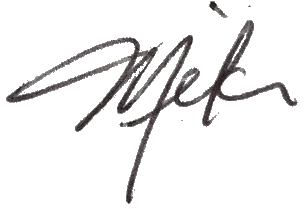

Preface
=======
Welcome to Learning C with Pebble.  I'm glad you are (at least considering) spending some time with this book.

This book is a lot different than most books you will encounter.  The first difference you will see is how you got here: it's published online in open source format.  Publishing on [gitbook.com](http://gitbook.com) means a couple of things that makes this different:
* It means that this book represents a work in progress.  It will be released incrementally, sections at a time.  It will be updated regularly: errors will be fixed and new content will be added.  Instead of issuing "editions", we will work on one continual edition, in versions.
* It means you can have your own copy for free.  You can read the book right here or you can download it in PDF or several eBook formats.
* It means you can get a source copy and add your own content.  The source of the book is in [Markdown](https://en.wikipedia.org/wiki/Markdown) formatting, which is a text-based format with formatting directives in the text.  It's easy to work with and easy to extend.

This book is also different because of the Project Exercises at the end of every chapter.  Many books on C programming will include questions or short exercises with each chapter.  For this book, we have produced "project" exercises.  These are complete Pebble smartwatch applications that start you off with something to work on and ask you to make changes.  The "answers" are also produced and available for you to view.  And the work is specified in the context of the [CloudPebble](http://cloudpebble.net) online IDE.  You can work with each project in an online emulator or directly on a real Pebble smartwatch.

These project exercises can be effective in a number of ways.  They are a great way to highlight the topics of each chapter.  They are also a great way to learn how to build C programs that work on a [Pebble smartwatch](https://www.pebble.com).  They give you many examples from which you can derive your own apps.  And they can teach you to be more comfortable with code that is unfamiliar.  This helps you build applications from a foundation of other example code.

There are a lot of people involved with this book to whom I am very grateful. The first is to my wife, Peg, who puts up with my many obsessions, including Pebble smartwatches and writing this document.

There are several people at Pebble who had crucial roles with getting this book published.  [Cat Haines](https://twitter.com/_cathaines) and [Jon Barlow](https://twitter.com/orviwan) were instrumental in making these chapters a reality.  They worked with day-to-day updates and were my direct line to Pebble.  [Thomas Sarlandie](https://twitter.com/sarfata) and [Kevin Conley](https://twitter.com/kevindcon) fielded my first ideas and saw some worth in them, connecting me with Cat and Jon.  

Finally, some really smart people from the [Pebble community on Slack](http://slack.pbldev.io/) proofread the chapters and helped make the Project Exercises a reality.  They worked on the code, made their own suggestions, and produced some very effective learning tools.  Here's a list:
* [Allan Findlay](https://twitter.com/allanf175)
* [Paul Niven](https://twitter.com/NiVZ)
* [Mathew Reiss](https://twitter.com/mydogsnowy)
* [David Rodriguez Rincon](https://twitter.com/dabdemon)
* [Rob Spiess](https://twitter.com/robisodd)

Finally, a special thanks to [Juan Sanchez](https://twitter.com/juansanchez) for his beautiful artwork and to [Ryan Perry-Nguyen](http://twitter.com/rperryng) for his meticulous attention to editing.

So, enjoy the book.  Some very intelligent people have worked hard to produce something that is readable and packed with examples and code and projects.  We all hope you find this a great way to learn the C programming language on Pebble smartwatches.

Mike Jipping 
Hope College 
Holland, Michigan USA 
[jipping@hope.edu](mailto:jipping@hope.edu) 
