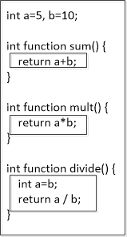
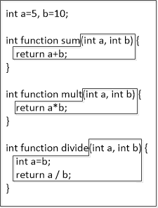
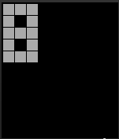

Chapter 6: Working with Functions
=======
Abstraction is one of the most powerful tools used by a software developer.  We have seen basic abstractions already: variables are abstractions of memory and statements are abstractions of machine instructions.  When we use abstractions, we want to see the big picture, to use something that just works, and we want to ignore the details of how it works. 

Abstraction is at the heart of why we use functions.  Functions give us perhaps the most power we have had yet to use abstraction to our liking.  

In this chapter, we will describe how to call, design, and implement functions for all these things.  We will see how functions are at the heart of the way we work with Pebble OS and how we can use them to hide many details, to focus on algorithmic design, and to structure our code.

### The Basics of How Functions Work ###

We have seen functions already and have appreciated the abstraction they provide.  We have used functions like `printf` and `text_layer_set_text`.  We have explained *what* they do, but we have not examined *how* or *why* the code works.

Let's consider a function reference we have seen and walk through how it works.  Consider this:

    strftime(time_string, sizeof(time_string), "%T", tick_time);

There are two function references in this statement: `sizeof(time_string)`, which gives the size, in bytes, of the string held in `time_string`, and the entire `strftime` reference, which will take the time variable `tick_time` and create a string in `time_string` that describes the time.  

Even though we depend on abstraction here, there is a C code definition somewhere for both of these functions (we will describe where these definitions can be found in a later chapter).  When we reference a function by name, say, by using `sizeof(time_string)`, the execution of the current code stops and execution is transferred to the definition of the function `sizeof`.  This is referred to as *calling* a function.  When the function's code has been executed, execution is transferred back to the code that called the function.  This is referred to as *returning to the caller*.  

When some functions return, they carry with them a value that can be used as if a variable were referenced.  When the call to `sizeof(time_string)` returns, it brings with it an integer value that is the size of the `time_string` data structure. When a function returns, it brings a value of a specific data type, described in the code that creates the function.

When some functions return, they bring nothing with them.  They simply have executed some code, then returned.  When the call to `strftime` returns, the function has built a time description into `time_string`, but brings no value back with the return.  These functions are said to return *void* values.

### Function Parameters ###

Functions are pieces of code that do some work and return a value.  In order to operate, functions often need data on which to work.  We exchange that data with functions through parameters.

Parameters are specified between the parentheses in the function call.  When we call a function like this:

    sqrt(2)

the parameter is the value 2 and the return value is the square root of 2.  Change the parameter value and you change the return value.  

Like variables, parameters have data types.  In the case of functions, however, a parameter's data type is the type the function *expects*.  In the case of the `sqrt` function, the data type of parameter is double.  So if we tried to call the function like this:

    sqrt("two")

the compiler would complain of an error with parameter data types, because the string "two" cannot be cast to a double data type.

The parameter list also has an *sequence order*.  Parameters are matched left to right with the parameters specified for the function.  This means that our call to `strftime` above *must* have parameters in the order given: string, integer, string, time type.  This is the order that the function expects and any other order will cause an error -- either from the compiler or at run time.

>**Compile Time or Run Time**
>
The errors that can be caught when the program is being compiled are called *compile time* errors; the errors that are caught when the program is executing are called *run time* errors.  Which are easier to find?
>
Compile time errors are static errors.  Static errors are those that are in the syntax of the code or the compile time semantics of the code.  Static errors don't change until you change the text of the code; a compiler can find then each time a program is compiled.
>
Run time errors are often dynamic errors.  They present themselves only when the conditions are right.  When run time conditions force the code with errors to be executed, the errors surface.
>
Static errors are much easier to find than dynamic errors.  You can find static errors when you review code with a sharp eye.  Dynamic errors often are not caught until you run code with certain input.  On a Pebble watch, dynamic errors might come to light only at certain times of the day. 

### Function Headers ### 

The specification of the return type of a function, along with the order and types of the parameters, is called a *function header*.  Because some functions are abstract (some are not -- see the next section), this header tells the programmer *how* to call the function and *what to expect* as the return value.

As an example, the header for the `sqrt` function is 

    double sqrt(double x)

This specifies the name of the function as "sqrt", it returns a double data type, and it takes 1 double parameter.  That's all a programmer needs to use this function.  

Consider the header for the function `text_layer_set_text` that we have seen before.  It has a more complicated header:

    void text_layer_set_text(TextLayer * text_layer, const char * text)

For this function, there are two parameters.  The first is a *pointer* to a text layer variable (we'll go over pointers in Chapter 8).  The second parameter is a *pointer* to a character variable, which we have seen as a string.  The function does not return a value, specified by the use of `void` for the return type.

When using functions that are already coded for you, like those supplied by a standard C library or by Pebble for use with watches, all you need is the header to know how to use the function.

### Building Your Own Functions ###

Functions can be supplied to you already coded.  You can also build your own functions.

To build your own function, you need to supply *both* the function header -- giving name, return type, and parameters -- and the code that implements the function and computes the return value.  

#### The Basics ####

To design your own function, your code must adhere to the following form:

<pre>
<i>return_type</i> <i>function_name</i>(<i>parameter_list</i>) 
{
    <i>function_body_code</i>
}
</pre>

Let's go through each of these elements:

* The *return_type* is a declaration of the return value's data type.  In the examples we have seen, the `sqrt` function returns a "double" data type value and the `text_layer_set_text` function returns a "void" type.  The value you return (see below) must match this data type.  In the case of "void", the function should return no value at all.

* The *function_name* is the name that will be used to call the function.  This name must abide by the same rules as variable names: a combination of letters, numbers, and an underscore, starting with a letter or underscore.  

* The *parameter_list* can be empty or can specify parameters needed for the function.  Parameters have a huge amount of flexibility and will be discussed in the next section.  But at this point, it is sufficient to note that a parameter list needs parameter data types and name, separated by commas.

* The *function_body_code* is a set of statements that perform the purpose of the function.  The code can manipulate program data and parameters and can return values to the caller.

Let's take an example.  Remember the second hand project in chapter 4 (Project 4.1).  We computed the second hand position using this code:

    int dangle = TRIG_MAX_ANGLE * second /  60;
    position_x = center_point_x + (radius*direction*sin_lookup(dangle)/TRIG_MAX_RATIO);
    position_y = center_point_y + (-radius*cos_lookup(dangle)/TRIG_MAX_RATIO);

Let's say we want to make two functions: one to compute the X position and one to compute the Y position.  Here's the steps we might go through to write those functions:

1. **Return type:** The return value of each of the function is assigned to an integer variable.  So it makes sense that the return type of each function is "int".
2. **Function name:** Here, we can be as creative as we want.  As with variables, names should be descriptive.  We will name the functions `secondhand_x` and `secondhand_y`.  
3. **Parameter list:** The computations above use several pieces of information.  The X computation uses the variables `center_point_x`, `radius`, `direction`, and `second`, all of which are integers.  The Y computation uses `center_point_y`, `radius` and `second`, which are also all integers.  Note that we do not need to use the same names for parameters that we did when they were variables, but we should still use descriptive names.
4. **Function body code:** We can write these functions as below:

        int secondhand_x (int center, int rad, int dir, int sec)
        {
            int dangle = TRIG_MAX_ANGLE * sec /  60;
            int pos = center + (rad*dir*sin_lookup(dangle)/TRIG_MAX_RATIO);

            return pos;
        }

        int secondhand_y (int center, int rad, int sec)
        {
            int dangle = TRIG_MAX_ANGLE * sec /  60;
            int pos = center + (-rad*cos_lookup(dangle)/TRIG_MAX_RATIO);

            return pos;
        }

Notice that we have changed some of the names of the parameters / variables slightly.  In this definition, the parameters are known by the names given in the parameter list.  Also notice that we declared our own variables inside the function and used those variables rather than variables outside the function definition.  If our goal is to implement abstraction, then each function needs to be as independent from the surrounding code as possible.  Finally, notice how we return a value with the "return" statement; more on this is below.

We would call these function definitions as follows:

    position_x = secondhand_x(center_point_x, radius, direction, second);
    position_y = secondhand_y(center_point_y, radius, second);
  
#### Parameters ####

Parameters are the main way we communicate between the caller code and the function code.  To help discuss parameters, we should first understand that there are two types of parameters: *formal* and *actual* parameters.  Formal parameters are those defined in the function specification.  Actual parameters are those used in the function call.  

We make this distinction for a couple of reasons.  First, the function specification can only access the formal parameters and must be written using the formal parameters, assuming they have a value.  In the examples above, we had to define the functions using the parameter named `center` even though we called the functions with the variables named `center_point_x` and `center_point_y`.  The parameters are separate entities from the variables that are used to call the functions. 

Second, we can now discuss how values are transmitted from actual to formal parameters during the function call. In the function definition, the formal parameters are treated like variables.  This makes sense, because at execution time, these formal parameters do indeed stand for memory locations. The formal parameters receive values from the actual parameters in the function call like assignment statements.  

Finally, this distinction allows us to discuss assignment issues like type casting and static typing.  These issues are at play just like they are at play with variables and assignment.

Let's take a simple example.

    float sum (int a, float b) {
        return a+b:
    }

This simple function requires two parameters in a function call: an integer and a float.  It returns a float value.  Let's say we call this function like this:

    float s = sum (5,6);

The execution of the function definition will start after the values are passed between actual and formal parameters.  The parameter `a` will take on the value `5` and the parameter `b` will take on the value `6.0`, after the integer parameter's value is cast to a float.  Then the sum will be computed as a float value and returned as `11.0`.

Notice in the above example that we have to work with `a` and `b` as formal parameters regardless of what parameters are used during the function call.  This is a great example of the abstractions provided by the C programming language.

#### Parameter Passing Modes ####

In the previous section, we discussed parameter passing like it was assignment of variables: formal parameters are assigned the values of the actual parameters.  This mode of passing parameters from actual to formal is called *pass by value*.  The values of the actual parameters are evaluated and passed/assigned to the formal parameters before the function is executed. 

If you think of passing parameters as an assignment operation, then pass by value makes sense.  But this parameter passing mode restricts assignment to one way: from the actual to the formal parameters.  Consider this example:

    float sum2 (int a, float b) {
        a++;
        return a + b;
    }

Now, if we call this function like this:

    int x = 10;
    float s2 = sum2(x, 10);

You might think that, if `a` is changed, the changed value is sent back to the caller, changing the value of `x`.  But this is not the case.  Pass by value only passes values one way: from the caller to the function definition, from actual parameter to formal. In this example, `x` does not change its value. Because of this one way assignment, we can still call the new function like this:

    float s3 = sum2(100,200);

and not worry that somehow the value 100 changes to 101!  

There is one more parameter passing mode in C: call by reference.  This mode passes a *reference* or *pointer* to a parameter, rather than the value of the parameter.  When the variable that the parameter references changes, the value changes immediately for the caller as well.  We will complete this discussion in the next chapter, after we have discussed pointers.  

> **There are Other Parameter Passing Modes**
> 
Pass by value and pass by reference modes are common in programming languages.  But, there are other parameter passing modes.  
>
*Pass by value-result*: Also known as "copy-in, copy out", this method is used in only a few older languages.  Parameters as assigned to formal parameters, then the values of the formal parameters are assigned back to the actual parameters when the functions return. When this mode is used, only variables may be used in a function call; literal values cannot be used.
>
*Pass by Name*: This is an interesting parameter passing mode used by early programming languages (e.g., Algol).  When pass by name is used, the effect is like the *name* is passed and the calculation is deferred until the value is needed. Like pass by value-result, variables must be used in a call.  For example, if we called the function `sum2` above using call by name, MORE HERE

#### Returning Values ####

Functions are designed to return a value.  Values are returned to the caller by using the "return" statement. We have seen this in examples.  The form of the return statement is this:

<pre>
return </i>expression</i>;
</pre>

When the return statement is executed, the expression is computed, execution of the function stops, and execution resumes at the point after where the function was called, with the computed expression value substituting for the calling statement.  

The data type that results from computing the expression in the return statement must be compatible with the data type given in the function header. If the data type in the function header is given as "void", then the expression for the return statement should be omitted.

As an example, consider this function header:

    double max (double num1, double num2) 

This function will return the maximum of the two parameters it is sent.  The return statements used must have an expression that results in something that is of data type "double".  Let's finish the function:

    double max (double num1, double num2) { 
        if (param1 > param2) { 
           return param1;   
        } else { 
           return param2; 
        } 
     }

It's quite simple to verify that each return statement is returning a "double".  Note that any valid C expression will suffice for a return statement.  We could easily have written this function as this:

    double max (double num1, double num2) { 
        return param1>param2 ? param1 : param2; 
     }
 
Here's an example of a "void" return value:

    void announce (int age) {
        printf("It's birthday time!  We celebrate an age of %d!\n", age);
    }

No returned value is needed because the function is performing an action, not a computation.

There is a common error in function returns that we should note.  It is easy to build a function with unreachable statements.  For example, consider this function:

    int absolute (int value) {
        if (value < 0) 
            return -1*value;
        return value;
    }

This is a correct way to return the absolute value of an integer parameter.  So let's say that, upon reflection, the programmer decides to write an else part to the if statement, which he feels would be better programming.  The function now looks like this:

    int absolute (int value) {
        if (value < 0) 
            return -1*value;
        else
            return value;
        return value;
    }

The mistake here is that the last return statement will never be reached.  The if statement will result in some value being returned and execution will never reach that last statement.  

This is an easy mistake to make.  Fortunately, compilers will flag that last statement as an error and will usually force you to remove that statement.   

### Functions as Parameters ###

Let's say we need to write a function that must print a list, using a `get_list_item` function to get an item to print.  You might write a function to do this like this one:

    void print_list() {
        int num;
        for (int i=0; i<number_of_items(); i++) {
            num = get_list_item(i);
            printf("Item #%d is %d\n", i, num);
        }
    }

This is a simple function that does a simple task.  Now let's say we want to use this function to print items from several lists.  We might use functions called `number_of_items_2` and `get_list_item_2` to work with a second list and `number_of_items_3` and `get_list_item_3` to work with a third list, and so on.  It is tempting to rewrite this function into a second and even third version for each of the lists.

A better solution would be to use one `print_list` function and to allow users to send *as parameters* the functions to use to number the lists and to retrieve an item.  We can use functions as parameters by expanding our idea of a parameter.

In order to specify a function as a parameter, we must give the entire function header as the parameter specification.  This means giving the return value, name, and parameter list of the function we will use as a parameter.  But we must specify this in abstract terms.  We must use the following form:

<pre>
<i>data_type</i> (*<i>name</i>)(<i>parameter_list</i>)
</pre>

for each function parameter.  So, for the example above, we need to list two functions (one for number of items, one for item retrieval) as parameters.  We might do this as follows:

    void print_list( int (*number_of_items)(), int (*get_list_items)(int) )

This is messy, but let's walk through it.  The name of the function being defined is `print_list` and it has two parameters that are functions.  The first formal parameter function is referred to as `number_of_items` and it takes no parameters and returns an integer.  The second formal parameter function is referred to as `get_list_items` and it takes one parameter, an integer, and returns an integer.  With this declaration, the code for the function for all ways to print a list remains the same, using the parameters as placeholders for the actual parameter functions.

So, we might use this function as follows:  

    int n_items() { return 10; }
    int get_a_random_number(int choice) { return rand() % 10; }

    print_list(n_items, get_a_random_number);

Here, we have defined two functions needed by `print_list` above and we have called `print_list` with those functions as parameters.  Note that we have simply used the function names and `print_list` just assumes that they have the right header (the compiler will enforce this).  For this example, we are getting 10 random numbers and printing them (and ignoring the `choice` parameter).

### Name Accessibility and Function Headers ###

We discussed name accessibility in Chapter 3; here are the two rules we described:

1. You must declare names before you use them.
1. Code can only access names declared at the current block level and outer block levels.

With functions, we have introduced more ways to build structured code blocks.  Rule #2 above is important to keep in mind as we build functions into our code.

Consider this example.

    int a=5, b=10;
   
    int function sum() {
        return a+b;
    }

    int function mult() {
        return a*b;
    }

    int function divide() {
        int a = b;
        return a / b;
    }

We can draw our blocks in this code, according to the curly brackets, like in Figure 6-1.

<figure>
   

   
   <figcaption>
      <b>Figure 6.1:</b> Block structure for the above example code. 
   </figcaption>
   

</figure>

In the `sum` block, two variables are referenced: `a` and `b`.  The search for these names begins in the most inner block and proceeds outward.   There is no such variables in the inner block, so we go the first outer block.  In this block, there are the variables we need and the values of these are used.  The same sequence happens with `mult`.  With `divide`, the sequence is a bit different.  The inner block defines a variable called `a`.  So this one is used, taking on the value of `b` from the outer block.  Then the division divides `a` from the inner block by `b` in the outer block.  Since `a` = `b`, the result is always 1.

We need to define how function names and parameters fit into this block structured model.  Let's change the above code to add parameters to the functions.

    int a=5, b=10;
   
    int function sum(int a, int b) {
        return a+b;
    }

    int function mult(int a, int b) {
        return a*b;
    }

    int function divide(int a, int b) {
        int a = b;
        return a / b;
    }

Now the block structure looks like it does in Figure 6-2. 

<figure>
   

   
   <figcaption>
      <b>Figure 6.2:</b> Block structure for the above example code with parameters. 
   </figcaption>
   

</figure>

Note here that function names belong to the outer block and function parameters belong to the inner block.  When we define out functions like this, the computations now use the parameters instead of the outer block variable names.  In fact, this version of the `divide` function is in error!  The declaration of `a` as a local variable is in error because there is already a name of `a` defined in the current block as a parameter.   

### Data Typing Issues ###

When we define functions, we give the return data type and the data types of each parameter that is defined.  The types of the parameters used in the call and use of the return type must adhere to the data types defined by the function header.  Casting is used when it is appropriate.  

So we can call the functions in the last example in the previous section like this:

    int dualsum = sum(a,b) + sum(b,a);
    int more = sum(a,b) * mult(a,b);

These adhere exactly to the typing that is define above.  We can mix types up like this:

    float multiply = mult(4, 3);

This works because the integer return value of `mult` can be cast to a float data type.  

Consider this:

    float floatmult(int a, int b) {
        return (float)a*(float)b;
    }

Now if we call this with float data types or assign the value to a float variable, we will get errors.  Each of these calls will cause an error:

    int x = floatmult(10,20);
    float f = floatmult(10.0, 20.0);

### Recursion ###

A function that is defined in terms of itself -- one that calls itself somehow -- is called a *recursive* function.  Recursion is a useful tool for defining solutions to problems and to implementing those solutions.  

Some problems are best solved by recursive solutions.  An obvious recursive definition is a factorial.  Recall that in Chapter 5, we gave an example of a factorial solution with a while loop:

    factorial = 1;
    while (number > 0) {
        factorial = factorial * number;
        number--;
    }

We can also define a recursive version, remembering that *n! = n \* (n-1)!* 

    int fact(int n) {
        if (n <= 1) 
            return 1;
        else 
            return n * fact(n-1);
    }

For recursion to work correctly, the problem being solved must have have two properties: a *base case* that defines where the recursion stops and a *next case* that defines how the next step is computed, given the current step have a value.  In the factorial example, the *base case* is *n = 1*, where we simply define that *1! = 1*.  The *next case* is the step where, given we have the value `n`, we generate a factorial as `n * fact(n-1)`.  

Another classic example of recursion is the computation of Fibonacci sequences.  In Chapter 5, we gave the an example of this computation using a do/while loop:

     int first=0, second=1, next;
     do {
         next = first + second;
         first = second;
         second = next;
         printf("%d\n",next);
         number --;
     } while (number > 1);

In the code above, we can see two base cases.  The first number is a sequence is 0 and second is 1.  The remaining terms are equal to the sum of the two previous terms.  That's the next case.  We can write this as follows:

    int fibonacci(int n)  {
        if(n == 0)
            return 0;
        else if(n == 1)
            return 1;
        else
            return fibonacci(n - 1) + fibonacci(n - 2);
    }

If you are considering using recursion, you should consider the following issues.

1. *The memory requirements of recursion are considerable.*  Each function that is called takes up memory to store its variables and information about the calling structure.  This memory is released and reused when a function returns.  Recursion forces each instance of the recursive function to remain in memory while a new instance is formed.  Many recursive steps will take up extensive amounts of memory.  The execution environment may limit the number of recursive calls a program may make.

1. *Infinite recursion is easy to fall into.*  Recursion is a concept that is twisted enough from regular programming that it is easy to make mistakes with it. A common error is to write code in which the base case is never reached.  In the `fibonacci` definition above, if we called `fibonacci(n+1) + fibonacci(n+2)` instead of the correct code in the example, the base case of `n == 0` or `n == 1` would never be reached and code would call itself infinitely.  Then, like the previous note, memory would fill up and the program (and perhaps the computer) would freeze and/or crash.  

1. *Recursion can (and should) be rewritten as iteration when possible.*  While some problems lend themselves to a recursive solution, iteration is usually the better form to use. Iteration is clearer in its description of the solution algorithm.  Iteration is also less memory and resource intensive.  So if you can, you should write a solution using loops rather than recursion.

### Functions, Organization, and Algorithm Development ###

Functions are very useful tools for a number of reasons.  As a C programmer, you should develop habits that include using functions wherever you can.

First, functions can reflect the development steps one goes through to develop a program.  By exploiting abstraction, functions can be used where steps appear in an algorithm, allowing the programmer to ignore implementation while the algorithm is being built.  Functions without implementation become placeholders; function with implementations reflect the algorithm design and help document it. 

A second reason to use functions is that their code can be reused.  They are particularly handy when the same steps are used in several places in a program.  Instead of copying statements, a function can be called.  In addition, function code can be reused in other programs.  Spending lots of time crafting an incredibly useful function that will send email, for example, can pay off many times over when you include it other programs.  

Finally, using functions makes your program more modular.  Modularity is a property of program code that makes functions independent from each other.  When code is modular, functions can be easily replaced by improved functions.  Errors are more easily found because modular code isolates functionality into specific functions.  Code that implements functions with specific, focused purposes is code that can be understood better. 

### Project Exercises ###

#### Project 6.1 ####

We started this chapter talking about changes to Project 4.1 from Chapter 4.  For this project exercise, actually make those changes and get the resulting code to run.  [You can start with project 4.1 here.](https://cloudpebble.net/ide/import/github/programming-pebble-in-c/project-4-1-answer)  Given the walk through in that "Basics" section, you should be able to create something with functions easily.

[An answer can be found here.](https://cloudpebble.net/ide/import/github/programming-pebble-in-c/project-6-1-answer)

#### Project 6.2 ####

[Consider the code in Project 6.2, available here.](https://cloudpebble.net/ide/import/github/programming-pebble-in-c/project-6-2)  This code will display a pattern, as depicted by bits in a string.  In this starting code for Project 6.2, the string "111101111101111" can be broken into 5 rows of 3 bits each, which can be displayed like this:

<figure>
   

   
   <figcaption>
      <b>Figure 6.3:</b> Emulator running Project 6.2 
   </figcaption>
   

</figure>

Make the following changes to the code:

1. Move the nested for loop to a function, with this header: `void draw_digit(GContext *ctx, char * digit)`.  Call that function from the `canvas_update_proc`.  
2. Add code and additional parameters to the function to draw the pattern at any (x,y) coordinate.  You will have to use these new parameters in the function definition.
3. Now use the function in `canvas_update_proc` to fill the screen with the pattern.  You might think about these questions:  How do you know how many patterns fit onto the screen?  How do you call `draw_digit` with the appropriate parameters?  Add a variable that stores the size of the individual tiles used to draw the digit to make the calculations easier.  As an experiment, see what happens to your display if you change the size stored in the tile size variable.
4. Now, draw four digits grouped together in the center using similar calculations in the loop.   We will revisit this method in the next chapter as a watchface.  This can also be influenced by changing the size of the tile size variable.

Finish this project by placing comments at the beginning of the code that identifies the code by project and adds your name.

[You can find an answer here.](https://cloudpebble.net/ide/import/github/programming-pebble-in-c/project-6-2-answer)

#### Project 6.3 ####

[You can find starting code for Project 6.3 here.](https://cloudpebble.net/ide/import/github/programming-pebble-in-c/project-6-3)  This project asks you to work with drawing text.

Examine the starting code for this project.  In its current state, the code will not run, because `graphics_layer_update_callback` calls a function that you have define that is not in the code.  The initial code calls this function `fill_the_rectangle` and sends it two parameters: width and height.

Add this function to the code.  This function should draw a rectangle of a given size (width and height) with as much of text as possible with a font specification sent as a parameter.  You will need to design the name of the function, the parameters, and the code.  Repeat the text several times if necessary.

In order to draw the text, you will need to use several functions. First, you will likely need the size on the screen that the text will take up.  You can get this as:

    GSize size = graphics_text_layout_get_content_size(text_string, font, 
                                                       GRect(0,0, width, height), 
                                                       GTextOverflowModeTrailingEllipsis, GTextAlignmentLeft);

The `GSize` data type is a struct (we will see these in Chapter 10); you can access the width of your text as `size.w` and the height of your text as `size.h`.  You will also need to use a function to draw the text; the function below will draw `text_string` in the font `font` at (`position_x`, `position_y`).
 
      graphics_draw_text(ctx, text_string, font, 
                     GRect(position_x, position_y, text_width, text_height), 
                     GTextOverflowModeTrailingEllipsis, GTextAlignmentLeft, NULL);
    
`ctx` is a graphics context that must be passed as a parameter.  You don't need to know this everything about this function to make it work (remember abstraction!).

Add comments at the beginning of the code that identifies the code by project and adds your name.

[You can find an answer here.](https://cloudpebble.net/ide/import/github/programming-pebble-in-c/project-6-3-answer)

#### Project 6.4 ####

[Consider the project code for Project 6.4, available here.](https://cloudpebble.net/ide/import/github/programming-pebble-in-c/project-6-4) 

This program draws concentric circles on the Pebble screen (which looks hypnotizing on a Pebble Time Round).  Examine the code.  The function `draw_circles` draws the concentric circles by using a for loop.

Your job is to remove the for loop, but draw the same screen by using recursion.  Think about these things:

* Should your function start with the largest circle or the smallest?
* When should you stop (that's the base case)?  
* How should you structure your function's data, including parameters, to communicate when the function should stop?

When you are done, claim the code by adding comments to identify you and the project.

[There is an answer to this problem at this link.](https://cloudpebble.net/ide/import/github/programming-pebble-in-c/project-6-4-answer)
