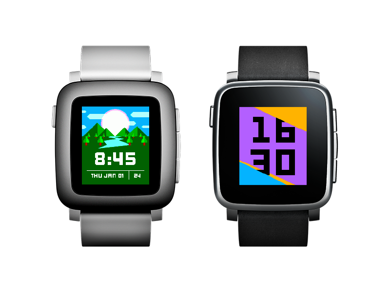
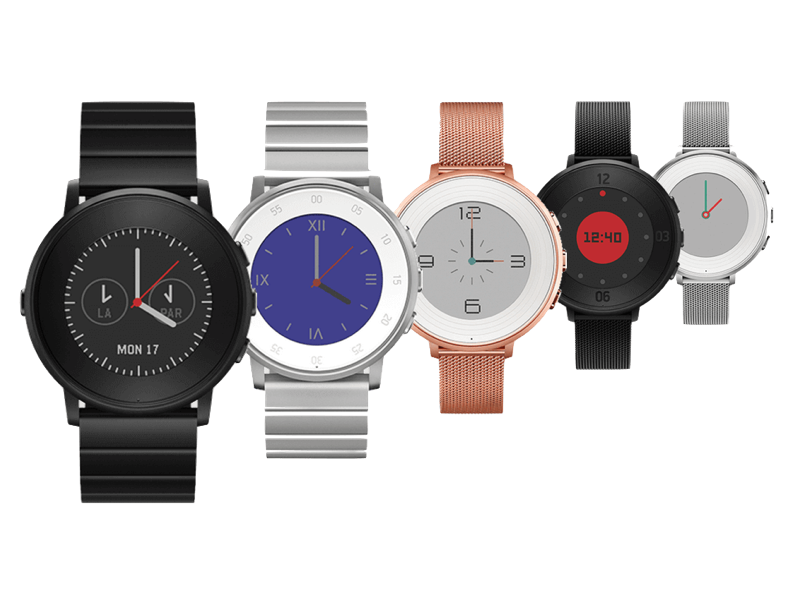
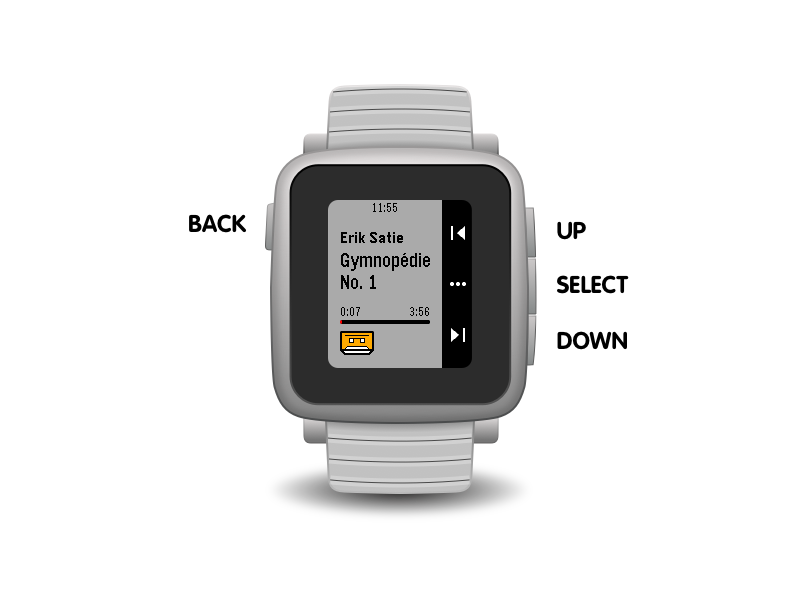
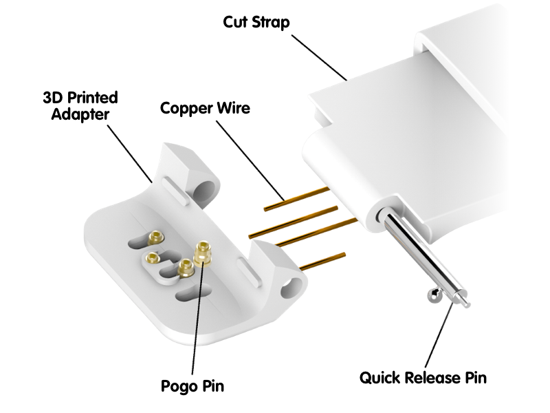
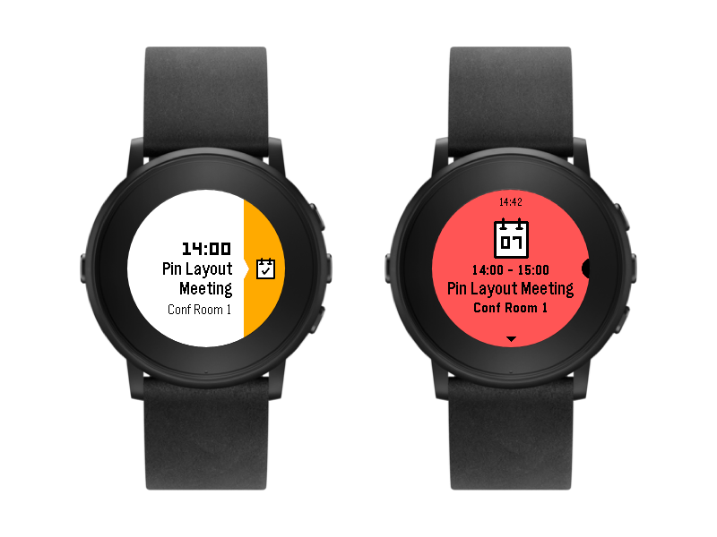
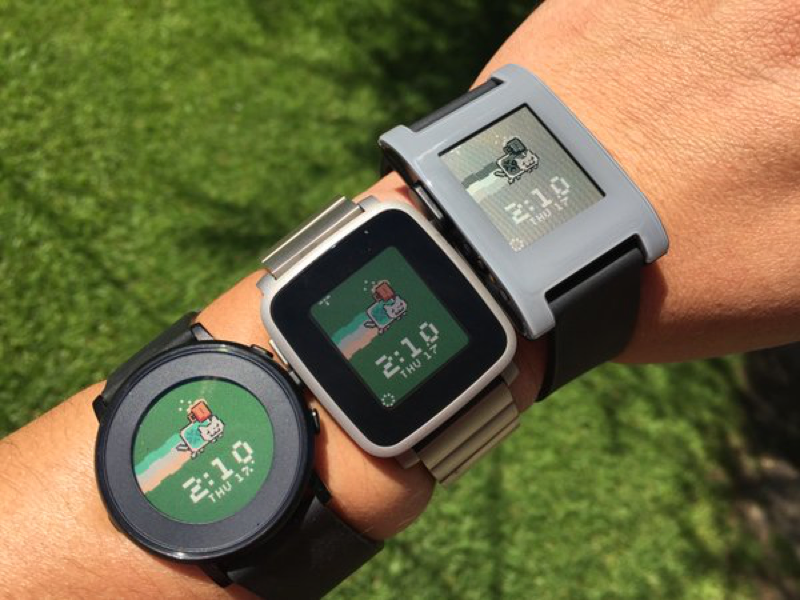

Chapter 1: Introduction
=======
In 1571, Robert Dudley, the first Earl of Leicester, wanted to impress the queen of England, Queen Elizabeth I.  He found a unique gift for her; he gave her a time piece to be worn on her arm and called it an “arm watch”.  It was a jeweled masterpiece, with diamonds and pearls and gold.  Among all the glamour, it contained a small clock piece, which kept time mechanically.  The queen was so impressed with her new watch that she commissioned several time pieces made for her, even one set into a ring, with an "alarm" that used a small armature to scratch her finger.  

Since that first gifting, the wrist watch has gone through many stages of evolution to become a valuable source of information.  Watches were simply decorations on bracelets until the late 1800’s, when “wristlets” that could strap pocket watches to wrists became popular.  German innovation popularized the mechanical wrist watch and shrank its size.  Quartz technology in the 1960's moved watches from mechanical, spring-driven movement to electrical, and most mass-produced watches from the 1980's on were driven by quartz movement.  The first digital watches were developed in the 1970's.  They combined quartz movement with electronics for display. As watch technology developed into this century, extra features were added to standard time and date displays, such as phases of the moon, timers, and alarm functions.  

Watches have become popular because they are a source of valuable information, strapped to a very convenient and accessible location.  One’s wrist as a source for information is easily accessible and very visible.  It makes sense, then, that a watch on the wrist is used for more than just time.   

### The Pebble Smartwatch 

In 2008, Eric Migicovsky was an engineering student at the University of Waterloo.  He wanted to build a device that allowed him to use his phone while riding a bicycle.  His solution was to combine a cell phone (a Nokia 3310 at the time) with an Arduino processor to produce a prototype for a "watch computer" that could obtain data from a phone.  For Migicovsky, this mashup of phone and computer was a student project, but it worked well enough to inspire him.  Migicovsky called this project the inPulse.  By 2010, with some ingenuity that stuffed electronics inside a 3D printed casing, the first prototype of the inPulse was created.  It was the start of what a smartwatch could do and it allowed people to imagine having a computer on their wrist.

Having gone through this first experience with inPulse, Migicovsky came up a new project: a watch called “Pebble.”  This time, the watch project was funded by backers through Kickstarter, a Web site for crowdfunding projects.  On April 11, 2012, the Pebble project launched with a goal of raising $100,000.  That goal was reached within 2 hours.  Within 28 hours, $1 million was raised.  By the end of the 30 day funding period, more than $10 million was raised from over 68,000 backers, breaking Kickstarter records (at the time).  These original Pebble smartwatches began shipping in January 2013.

Since the original Pebble, several other Pebble models have been released.  As of this writing, there are 5 models in the Pebble family.  The original Pebble smartwatch and its steel sibling -- the Pebble Steel -- continue to have a wide user base.  These are watches with a monochrome display and a battery life of up to 7 days.  The current line of watches -- the Pebble Time, Pebble Time Steel, and Pebble Time Round -- have color displays and and battery lives that range from 10 days for the Pebble Time Steel, to 2 days for the Pebble Time Round.

Figure 1.1 shows the Pebble Time and the Pebble Time Steel and Figure 1.2 show the Pebble Time Round. 

<figure align>
   

   
   <figcaption>
      <b>Figure 1.1:</b> The Pebble Time and Pebble Time Steel 
   </figcaption>
   

</figure>

<figure>
   

   
   <figcaption>
      <b>Figure 1.2:</b> The Pebble Time Round 
   </figcaption>
   

</figure>

Several features of Pebble smartwatches have proven to be attractive.  The extended battery life is a distinct advantage, especially when compared to other smartwatches.  The color displays can be viewed from many angles and outside in direct sunlight.  The watches are light and easily worn.  One the best features, however, is the easy way the watch can be programmed.  One can write applications that create new watch faces as well as applications that use all features of the watch: the display, the sensors, and the button inputs. All Pebble smartwatches have the same programming system: apps are written in C, turned into CPU instructions, uploaded to the watch through the Pebble app on a smartphone. 

This mean that, to take advantage of the easy programming features and write apps for the watch, one should learn the C programming language.  And that is what this book will help you to do.

### The Pebble Hardware ###

Pebble smartwatches have different configurations, but have several common elements.  

Inside a Pebble smartwatch is a display that can stay on without using a lot of battery power.  Called "e-paper", the display is a reflective LCD display.  The current displays are capable of displaying 64 colors.  The Pebble Time and Pebble Time Steel smartwatches have a resolution of 144 by 168 pixels; the Pebble Time Round has a resolution of 180 by 180 pixels.  Each display has a refresh rate of 30 frames per second, which enables rapid animations that look smooth and render with excellent image integrity.  

> **Why Does Refresh Rate Matter?**
> 
When the Pebble smartwatch was first introduced as a proposed design, one of the features that excited potential users was the screen's refresh rate.  Refresh rate measures the number of times images are redrawn on the watch's display.  This matters because it affects the smoothness of animation across the watch display.  While the human eye and brain are actually wired to perceive and process roughly 1000 frames per second, humans generally perceive data at approximately 45 frames per second.  Video is typically produced at 30 frames per second, which is well within the human capacity to process. The Pebble smartwatch refresh rate of 30 frames per second ensures that watch wearers will perceive animation as smooth and consistent.  

Each Pebble model has the same methods of interaction.  The watches do not have a touchscreen, but rely on buttons for input. As shown in Figure 1.3, there is one button on the left, designated as the *back* button.  There are three buttons on the right, typically referred to as the *up*, *select*, and *down* buttons.  These designations are only the typical uses; these buttons may be used for any purpose. In addition to button input, the Pebble Time models include a microphone.  Each watch also has a vibration motor. 

<figure>
   

   
   <figcaption>
      <b>Figure 1.3:</b> The button on a Pebble smartwatch</b>
   </figcaption>
   

</figure>

The processors in the various models of the Pebble smartwatch are all *system on a chip* (SoC) designs.  SoC designs are built with a processor and  various components that the processor needs to operate efficiently, all on a single chip.  For example, The Pebble Classic has an ARM Cortex-M3 processor, running at 80 MHz, with 512 KB of storage, communication ports, and several power modes all built into a single chip.  The Pebble Time's SoC is similar, using an ARM Cortex-M4 running at 100 MHz, with 1 MB of storage and encryption and audio capabilities built in.  It is interesting to note that the Pebble Time's SoC includes an floating point coprocessor, although the system does not support it yet.  It is also interesting that the Pebble Time's processor can run faster than 100 MHz, but is limited to that speed for power efficiency reasons.

In addition to storage for the CPU to use as it runs application, there is nonvolatile storage on each watch model.  The Pebble Classic and Pebble Steel had either 4 MB or 8 MB of storage, depending when the watch was manufactured.  The Pebble Time models had 16 MB of storage.  These storage capacities are built from flash memory and are external to the processor, which means they are not used for running applications, but are used to store data and watch apps.  In addition, there is read-only memory (ROM) storage that hold the bootloader, responsible for booting a watch, and the firmware, the software that runs the watch.  Ready access memory (RAM) is also provided, used to for temporary space in which applications execute.  The Pebble Classic and the Pebble Steel have 128 kB of RAM; Pebble Time models have 1 MB of RAM.  This memory is used by the system, to run the operating system software, by background programs, and by the currently running application.    

Pebble smartwatches have several sensors built into them.  Each model has an ambient light sensor that reads and delivers data on how bright the light is around the watch.  Each model has a 3-axis magnetometer that can act as a compass and delivers directional data. Each model includes a 3-axis accelerometer, which can render information about how the watch is oriented in space in 3 dimensions.  In addition, Pebble Time smartwatches also have a microphone built in.  We will discuss access to sensors and their data, including the microphone, in a future chapter of this book.  

All Pebble smartwatches have the ability to communicate with other devices through Bluetooth connections.  Each watch is able to communicate using Bluetooth standards version 2.1 and 4.0, and Bluetooth LE (low energy).   

Smartstraps were introduced with the Pebble Time.  A smartstrap is a watch strap that has extra electrical contacts that allow the strap to communicate with the watch.  The strap's contacts cover the power connector, which does multiple duties of connecting to power and connecting the straps to the watch's hardware.  Figure 1.4 has a depiction from Pebble's documentation of how a smartstrap's connectors are configured.

<figure>
   

   
   <figcaption>
      <b>Figure 1.4:</b> Pebble Time's Smartstrap connectors</b>
   </figcaption>
   

</figure>

There are currently [several projects described](http://makezine.com/2015/09/25/hacking-on-the-pebble-smartstrap/) online that take advantage of this smartstrap technology.

### The Pebble Software ###

While hardware forms the foundation of the Pebble smartwatch models,  it is the software that makes the watch come alive to the user.  As with most computing devices, the hardware is usually taken for granted and the software becomes the focus of use.  So with the Pebble: while the Cortex-M3 vs the Cortex-M4 forms a major upgrade between the Pebble Classic and the Pebble Time, the color display and what you can do with it is the most accessible and most exciting upgrade.  

Perhaps the most basic of software on each Pebble smartwatch is the Pebble operating system, aka Pebble OS.  An operating system provides access for software to the hardware of the computing device.  Pebble OS provides an interface for software to access the watch hardware.  It uses metaphors to provide this access, so the developers of software can more easily access this hardware.  

Operating system software may provide access to hardware in increments.  Not all hardware will be accessible to software developers.  For example, the Pebble Steel model included an LED light on the face that could display light in various colors.   While it was perhaps the intention of operating system developers to provide access to this light, it never made it into the software interface provided by the operating system.  The system's magnetometer sensor, on the other hand, was built into the very first Pebble, but was only made available to software developers in Pebble OS version 2.  Metaphors and appropriate, consistent software access take time to design properly.  

Another element that an operating system provides is a user interface.  In the case of a Pebble smartwatch, the user interface is extremely important.  The only methods of user interaction are buttons and microphone (on the Pebble Time models), and the display and vibration make up the output to the wearer.  Button input is quite flexible; Pebble OS will distinguish between single, double, and long presses and can detect when multiple buttons are used together.   

Since version 3.0, Pebble OS has built in a timeline interface in addition to watchfaces and watch apps.  The *timeline* is a user interface metaphor that presents time related information to the user through a timeline populated with time events.  This timeline can be accessed from the watchface display through use of the up and down buttons.  The timeline incorporates the use of *pins*, event and notification items that are tagged with time and displayed chronologically.  Figure 1.5 shows an example of a timeline pin and the details from that pin.

<figure>
   

   
   <figcaption>
      <b>Figure 1.5:</b> An example timeline pin and the details from it. 
   </figcaption>
   

</figure>

Pins are strongly linked to Web services on the Internet.  They can be placed on timelines by programs and they can be shared between several different users.  We will discuss the timeline and pins in a future chapter.

There are currently three different software platforms when one considers writing software for Pebble OS.  The Pebble Classic models use the *Aplite* platform.  This platform focuses on monochrome rectangular displays.  The *Basalt* platform was introduced with the Pebble Time, accomodating color displays that are also retangular.  The Pebble Time Round necessitated another software platform, called the *Chalk* platform, that moves common user interface elements from a rectangular interface to a round interface.  As an example, Figure 1.6 shows Basalt and Chalk side by side.  By using proper coding elements, a programmer can use the same code for all three platforms.

<figure>
   

   
   <figcaption>
      <b>Figure 1.6:</b> Aplite, Basalt, and Chalk software platforms. 
   </figcaption>
   

</figure>

There are two types of applications that one can write for Pebble OS: watchfaces and watch apps.  Both types are written in much the same way.  However, watchfaces focus on (naturally) displays that mark time, restricting code elements to input and display based on time and time components.  Watch apps expand the possibilities of an application, using the watch like a computer and controlling all elements of the interface. In a sense, watchfaces are watch apps, but there is a specific way of programming a watchface that makes it unique; for example, watchfaces cannot receive input from the watch buttons.

> **The Watchface Generator**
> 
A human can write watchface programs in many different styles.  However, watchface programs can also be derived from fixed templates so that they can be written by a computer.  The Watchface Generator Web site (at [http://www.watchface-generator.de](http://www.watchface-generator.de)) lets users design their own custom watchface, then writes the code necessary to implement that watchface and generates the right software package ready for installation.  While you can still write your own watchface code that might be more flexible or have more capability, the Watchface Generator can produce attractive and interesting watchfaces with no user coding. 

### The Phone App ###

Pebble smartwatches are made to work with mobile phones.  When a watch is turned on for the first time, it looks for a phone to help download operating system firmware.  The Pebble phone app is key to the operation of watches.

The phone app works on iOS or Android devices.   It delivers messages and notifications to the watch.  It acts as a transfer agent between network services and the watch.  Since the release of Pebble Time models, the app has had a locker that holds watch faces and watch apps.  The app represents a storage extension for the watch; when watch faces or watch apps are needed but not present on the watch, they are retrieved from the phone app.  

Pebble smartwatches access local and network resources through the phone app. Software written for each watch model can access network resources, but only through the watch app.  Any access to URLs or network based functionality must go through the phone app.  

So it is safe to say that the Pebble platform depends on the phone app for functionality.  This is mostly an advantage for Pebble smartwatches, because it allows the watch to be thinner (hardware like WiFi chips can be left off) and it allows the phone to share processing with the watch.

### How to Use This Book ###

This book is designed to help you learn C programming by using the Pebble smartwatch platform to demonstrate and execute programs.  The book is online for several reasons.

* The online accessibility means you can read this book from any device.  
* The book is accessible through Web browsers so it can use Internet resources.
* This book is on the Gitbook Web site.  This means you can fork the book, add your own content and submit it to us as pull requests.
* Finally, exercises can be run in CloudPebble through GitHub.

This book should be accessible by beginners as well as those who know the C language but want to write Pebble applications.  If you are just starting in C programming, then you should start at chapter 2 and work through each chapter in sequence.  If you are already a C programmer, you should also read chapter 2, but then find those features that focus on Pebble smartwatches, such as the user interface or sensor programming.  Seasoned C programmers could start at chapter 15.

Finally, note that this is a BIP: a Book In Progress.  The contents will change over time.  Errors will be corrected, content added, and exercises will be modified or added.  This is one of the reasons the book is published on gitbook.com, so that we can make this a better and more effective learning tool.

