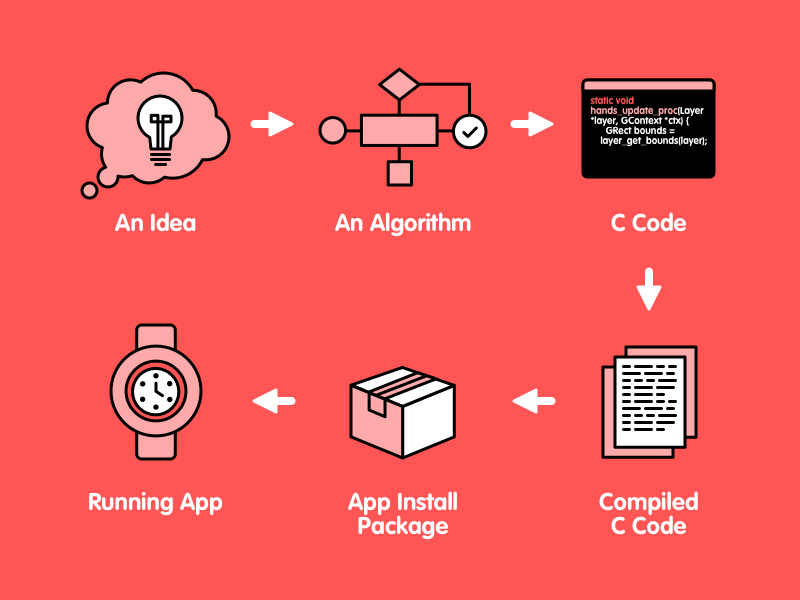

Chapter 11: How C Programs Execute
=======
Writing a Pebble smartwatch program is only the first part of the process to getting that program to execute on a smarteatch.  There are several steps to get a C program to execute and this chapter discusses how to get those C programs to run.

### Compilation ###

Let's review the development process we spelled out in Chapter 2.

<figure>
   

   
   <figcaption>
      <b>Figure 11.1:</b> The Development Process Again 
   </figcaption>
   

</figure>

The first three steps are from the programmer.  From an idea to an algorith to actual C code, these are steps that the computer can help with, but steps that must ultimately ßcome from you.

Compilation is where the computer starts to take over.  This is where the process of getting a Pebble app to execute really starts. 

The compilation process converts the C code written by you into compiled code, or ARM machine language.  The compiler used by the Pebble SDK is a version of the Gnu C compiler (GCC).  The compiler takes a syntactically and semantically correct C program and creates ARM machine language that correctly implements the algorithm represented by the C code.  Once created, this machine language is stored in a file.  

> ** The Linker and Machine Languages Files **
> 
Once your code is compiled, a file is generated that contains the translation of your C program to ARM machine langauge.  If you have multiple C program files in your project, multiple machine language files, called "object files", are generated: one for each C program file.  
>
In the end, a single ARM machine language file is what is desired.  The combining of object files into an ARM executable file is the job of the linker.  The linker builds on file by linking all the object files together, resolving the external references into local references and adding in references to any external libraries that are needed. The result is a single file, one that can be loaded into memory and executed.  

### App Install Package ###

In order to run on a Pebble smartwatch, the newly created machine language file needs a few other pieces of information.  This information is bundled with the program in "PBW" format: a collection of files that gives  information about the program along with resources the program needs to run.

The PBW file contains the following items in a compressed (ZIP) format.
* [A meta-data file](https://developer.pebble.com/guides/tools-and-resources/app-metadata/)
* Folders for each platform that the program can run on: "aplite", "basalt", and "chalk".
* Inside platform folders:
   * The machine language file for the program
   * More meta-data for the program
   * Resources needed to run the program: files, images, etc

If we remember that there is no permanent file system on a Pebble smartwatch, then this collection makes some sense.  It's all a program needs to run, in a compressed package.  Each smartwatch can hold a limited number of these packages and keeps the rest on the phone connected to the smartwatch.  The execution packages are transferred as they are needed.

### Starting A Program ###

Whatever operating system you are using to run your program, executing a program means loading the machine language for that program into memory and starting execution at an *entry point* for the program.  

For programs written in C, the entry point for the code is a function called `main`.   Every program must include a function called `main` somewhere in its code.  That function must adhere to the following function header:

    int main (int argcount, char *args[]) 
    
On a general purpose computer, where programs are typically started on a command line, programs can be started with "arguments".  These are options that are given with the program invocation as part of the command.  They can give direction to the program.  For these programs, `argcount` will be given the number of command line arguments and the `args` array will hold the values of these arguments.  The program name is typically the first argument.

On a Pebble smartwatch, arguments are not used, as apps are not started by users on a command line.  For these types of execution models, there is a version of `main` that does not have any parameters (or one `void` parameter to indicate no parameters); this is the version used on a Pebble.

On a Pebble smartwatch, execution occurs in a tight, resource-limited environment.  There is no real storage space other than memory. The smartwatch RAM is volatile memory that is used for apps.  There is a small area where persistent storage needed by an app can be stored.  Currently, there is only 4Kb of persistent storage for each app on the phone.  The phone storage is used for any necessary storage for apps that do not fit into non-volatile storage.  

When a program begins running on a smartwatch, it runs in a separate, restricted section of RAM set aside for apps. An app has it’s own thread, stack, and heap.  All this data exists in a section of memory reserved for app execution.  When a program is launched on a smartwatch, a number of things happen:
1. Any "old" data, such as app thread instructions and heap data, are cleaned up.  This means that clearing any data that the Pebble operating system keeps for the old app.  
2. The app program is loaded into it’s RAM section.
3. Data areas are initialized.  Static variables are created and given initial values and the dynamic memory allocation area, called the heap, is initialized from what is left over in the app's memory space (after the app code and static variables are loaded into it)
4. The program's code is started by placing the address of the entry point into the CPU's program counter.
5. The operating system manages the app and enables memory protection to prevent the app from accessing memory outside of its reserved area.

On a Pebble smartwatch, the section of code that is allocated for program execution is limited.  On the Pebble Classic series of smatwatches, this area is 24 kBytes; on the Pebble Time series, this area is 64 kBytes.  This means that all program code, variable memory, and dynamically allocated memory must fit into this area.  Large programs with lots of dynamic memory needs will not work well on a smarwatch.  

> ** More Information on Pebble OS **
> 
If you are really interested in how Pebble OS manages threads or shares the CPU between apps and background workers, the Pebble operating system is derived from Free RTOS, an open source real time operating system.  More information can be found at [http://www.freertos.org](http://www.freertos.org).

### Event Driven Programming ###

In our previous discussions about code execution, we have always referred to execution as *sequential*, that is, moving from statement to statement in a controlled, sequential, predictable manner.  However, there are many ways that users interact with computers and programs require a different perspective on code execution.

Consider a program for a Pebble smartwatch.  While there is probably some simple code that could be done in the `main` function, most code is run as a response to *events* that happen in real time.  These events include button presses, timer expirations, and various ways we have marked a graphics layer as "dirty".  *Event driven programming* is a structured way to program, one that defines events and ways to respond to those events.  When using this type of programming, there is a little setup, then control is turned over to some unseen system that listens for events and uses the program code to respond to those events.  This event response code is called a `callback`, which in most event-managed systems, is a function registered by the program as the response to a specific event.  

In the main function code on a Pebble smartwatch, we usually use the following code:

    int main(void) {
      init();
      app_event_loop();
      deinit();
    }
    
To set up a program for events, there is a small amount of initialization.  This is handled by `init()` in this example, a function that is defined by the program.  Likewise, there is likely a bit of clean up that should happen before a program terminates; this is handled by the function `deinit()`, defined again by the program.  Between initialization and clean up is a call to `app_event_loop()`, a function that is *not* defined by the program.  This function is supplied by the system and implements an *event loop*, a segment of code that waits for events to happen and uses callbacks to take care of those events.

Initialization might include creating a window to draw in or to display some text in.  There might be some random number generator seeding to do or some program variables might need initialization.  Initialization will almost certainly inform the system of what events are expected and the callbacks that will handle those events.    

Consider this example of an initialization function (from the snake project in Project 10.3):

    static void init(void) {
      window = window_create();
      window_set_click_config_provider(window, click_config_provider);
      layer_set_update_proc(window_get_root_layer(window), update_display);
      const bool animated = true;
      window_stack_push(window, animated);
    
      time_t now = time(NULL);
      srand(now);
    
      reset_game();
    
      layer_mark_dirty(window_get_root_layer(window));
    }
 
This code creates a window and establishes an update function to be called when that window is made "dirty" (that is, when it receives graphics activity).  It then pushes the newly created window onto the "window stack", which is the data structure that gets checked for events by the operating system.  Then the random number generator is initialized and the snake game is reset.  Finally, the code "manually" makes the graphics window dirty, firing the event that will be handled as soon as the system starts listening for events.

Clean up might include program algorithm cleanup, perhaps the freeing up of dynamically allocated memory, and will usually undo any window or graphics initialization that was done earlier.  Consider the example above.  Based on this initialization, clean up should be pretty simple.  We created a window, so we should dispose of the window we created.  Everything else here can be left alone.  So the clean up code looks like this:

   static void deinit(void) {
     window_destroy(window);
   }
   
### When a Program Terminates ###

When a program is done executing, the operating system has to do a few things.  The program must be removed from the queue of executing programs and its data will be deallocated and removed from any data areas.  Finally, the program must be removed from the system resource tables.

In the case of a Pebble smartwatch, most of these duties are very simple.  Because there is only one program executing a time (actually two, if you include the background worker), there is no queue of executing programs and there are very few system tables.  The code can be left in memory and memory resources, such as the heap, can be left alone in the program's old memory segment.  Clean up of "old" memory usually happens when a program is placed into memory (since there is only one spot to place an executing program), so clean up is minimal.  

There is one thing that a general purpose runtime system does that a Pebble smartwatch does not do.  On a general purpose operating system, dynamically allocated memory can expand beyond the original memory allocated for a program.  To properly reclaim this memory, freeing up dynamically allocations is a good habit to get into.  On a Pebble smartwatch, the confines of the original memory segment are strict and not expandable.  While freeing up dynamic memory is still a good habit, *not* freeing up memory has very little effect on the runtime of the smartwatch system.  
 
