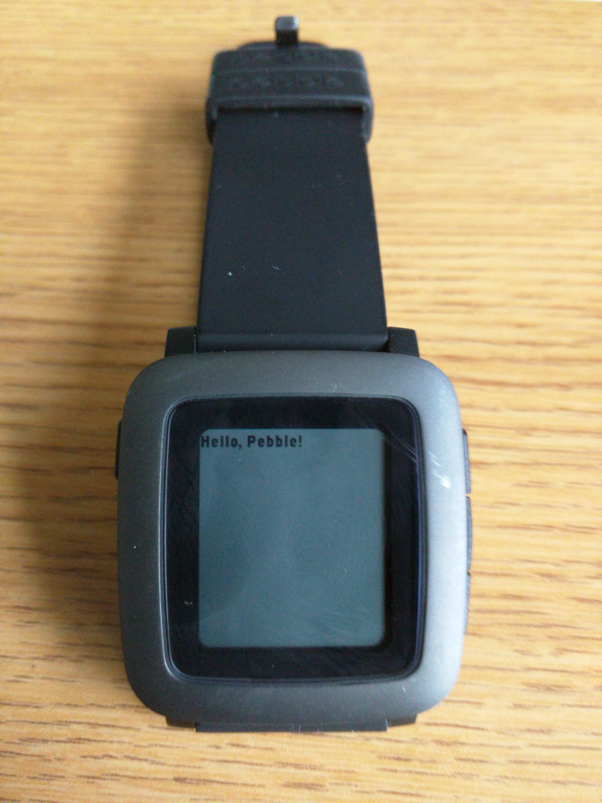

Chapter 2: First Things First: Developing Apps for Pebble Watches
=======
A professional craftsman is nothing without a toolbox. Tool sets are often unique to the person using them; certain tools are effective for certain people and not for others.  However, most professionals in a trade will all work certain kinds of tools, but the specific choices vary widely. 

So it is with programmers.  Each programmer, for example, needs to use a *text editor*. This tool allows its user to enter text into a file.  But if you want to touch off an argument in a group -- online or offline -- of programmers, ask a question about the best text editor.  And stand back!  If you want to get a list of text editors to try out, [search for "best text editors" on Reddit](https://www.reddit.com/r/pebble/search?q=best+text+editors).  

Developing applications for Pebble watches requires a set of tools and a sequence of steps. This chapter will explain and explore the process of developing, compiling, and running code for Pebble watches.  We will look at programming environments and what it takes to properly debug a program that is not working correctly.  We will developing an example application that will run on a Pebble watch.

### The Development Cycle ###
Developing an application for a Pebble watch -- or any computer -- starts with an algorithm expressed in a programming language.  

An algorithm is a collection of instructions.  Algorithms have different names in different contexts.  When you are cooking food, an algorithm is a *recipe* -- a collection of ingredients and instructions that, when followed, produces culinary delights.  When you are putting together things you bought in the store, an algorithm is usually printed for you and called an *instruction manual*.  On a computer, an algorithm is called a *program*.

A program is usually expressed in several forms.  It begins as a general, big picture set of algorithm steps.  As it gets refined, this set of steps eventually is expressed as a set of high level instructions in a programming language.  A programming language is a medium that represents a compromise between human-readable text and a format that can be parsed by a computer.  Programs must be expressed using consistent rules so computers can detect the various program elements and convert them into language that can be executed on a CPU.  At the same time, programs need to be flexible enough to embrace the original big picture set of instructions.   This is not an easy task.

C is a programming language developed by Dennis Ritchie in 1972 for use with the Unix operating system.  It was developed as a successor to the language B, which was one of the early higher level programming languages. The language B was designed as a easier way to influence low-level instructions without the tedium of writing machine language.  A drawback to B was that it was "type-less": variables could take on any value without regard to data types. C retained much of the syntax of B and added data types and a few other changes. The C language had a powerful mix of high level functionality and the detailed features required to program an operating system.

Machine language is the language of processors.  It is comprised of primitive instructions that match the primitive functionality of a CPU.  A high level statement that increments a variable might take three or four instructions at the machine language level.  Therefore, there must be tools that can convert from a high level language such as C to the low level language of a processor.

That "converter" is called a *compiler*.  A compiler must parse a program, convert the syntax and semantics of that program to internal structures, and then generate machine language code based on those internal structures.  To a programmer, the execution of the generated machine language code must match the semantics of the original high level program. This is the ultimate test of a compiler.

A compiler generates pieces of machine code that need to be put together into an *executable package*.  This package is typically built by a tool called a *linker* that puts the pieces from the programmer together with any system code that is necessary.  The end result is a package of several pieces of code and information that will allow an operating system to start executing a program.  

> **Influencing Machine Instructions**
>
Notice that the B language was designed as a way influence how machine instructions were used.  In its early days, C retained this goal: there are many language elements in C that are meant to influence which machines instructions are used in the final executable.  As C compilers developed and processors became more complex, the connection between a program in C and its representation in machine language has been relegated to the compiler.  C programs retain the syntax that was used to choose machine instructions, but C compilers are no longer required to obey constructs that programmers put into a C program.  
>
We will point out such elements as we describe the C programming language.

### Compiling and Running Programs for a Pebble Watch ###

As we saw in Chapter 1, Pebble watches are built with a version of an ARM processor. Any program written for a Pebble watch must be comprised of machine instructions for an ARM. There are number of steps from an application idea to an installed Pebble app, as pictured in Figure 2.1.

<figure>
   

   
   <figcaption>
      <b>Figure 2.1:</b> The Development Process 
   </figcaption>
   

</figure>

First, you have to get an idea for a watch face or a watch app.  This idea-gathering is outside the scope of this book, so it's your job to get creative.

Expressing this idea as an algorithm is the second step, and is also outside the scope of this book.  There are many methods to devising an algorithm from a set of ideas.  

The third step is to express your algorithm as a C or JavaScript program.  These are the two languages that can be used to write watch faces or apps for the Pebble.  You are reading this book because you want to the C approach and that's what we'll assume from here on.  C programs are written in text on a computer running MacOS, or Linux.  

Once you have a C program in a text file, the next step is to convert that C code to ARM machine language.  As we stated in the previous section, you do this with a compiler.  The Pebble software development kit supports developers by supplying compilers for MacOS or Linux.  These compilers will take a C program, verify its syntax and semantics, and generate a program in machine language in a format that can be installed on a Pebble watch.  This file is in PBW format: a collection of files that gives the machine language for a program, a set of checksums for security, and a file of maintenance information about the program (e.g., size, time it was created, etc).  

The PBW file must now be installed on a watch.  There are several tools that can do this, and each one does it through the phone app.  You can even transfer a PBW file to your phone and open it, at which point the phone app will take over and install the file.  

### Developing Our First Program ###

Let's take an example.  Let's say that we want to develop a simple first program for a Pebble Time watch.  It's just going to type "Hello, Pebble!" on the watch screen.  You can read a tutorial on how to do this at [https://developer.getpebble.com/tutorials/beginner/hello-pebble/](https://developer.getpebble.com/tutorials/beginner/hello-pebble/).  

Programs start with an idea.  Ours is a simple "Hello".  To get started coding this idea, we will need a C code program file.  A demonstrated in the tutorial page, we can accomplish feat by using the following code to initialize the watch:

    void init() {
        window = window_create();
        text_layer = text_layer_create(GRect(0, 0, 144, 40));
        text_layer_set_text(text_layer, "Hello, Pebble!);
        layer_add_child(window_get_root_layer(window), 
                              text_layer_get_layer(text_layer));
        window_stack_push(window, true);
    }

We will discuss all of the above code elements in future chapters.  There are two important lines in the above code: one where we create a text layer for a screen window and the next line where we set the text of the layer to be "Hello, Pebble".  This code is part of a larger program, where the remaining code is necessary to take advantage of the model the Pebble developers have established for working with the Pebble operating system.

Once the code from the tutorial is written and stored in a file -- call it "hello.c" -- we then must compile the code to get a machine language conversion. We can invoke the compiler on the complete file of code and we get the following output from the program:

    ./src/hello.c: In function 'init':
    ../src/hello.c:9:35: error: missing terminating " character [-Werror]
    ../src/hello.c:9:3: error: missing terminating " character
    ../src/hello.c:11:54: error: expected ')' before ';' token
    ../src/hello.c:13:1: error: invalid use of void expression
    ../src/hello.c:13:1: error: expected ';' before '}' token
    cc1: all warnings being treated as errors

This output is fairly cryptic, but there's an error.  The first line tells us that the error is in the file "hello.c" (the only file we have) and, further, in the function "init".  That means it is in the code referenced above.  The second line tells us that the error is in line 9 (you have to decode `../src/hello.c:9:35:` as the file "hello.c" in the "src" directory, with error code 35 at line 9).  There is a missing quote character.  Examining the third line in the code above you will discover that, indeed, we have the string `Hello, Pebble!` starting with a quote, but not ending with a quote.  Inserting a quote at the end of the string will make the code compile correctly.

As we will encounter many times, one error in a program often causes a cascade of other errors.  In our case, one missing quote caused 4 other errors.  So we will fix one error and see if the others go away.

When the compilation process is completed correctly, the process creates a PBW file ready for installation.  The SDK tools provided by Pebble for compilation and development also provide a way to install this on a watch.  Figure 2.2 shows the code running on a watch.

<figure>
   

   
   <figcaption>
      <b>Figure 2.2:</b> Our Hello Idea on a Watch 
   </figcaption>
   

</figure>

### Programming Environments ###

The development process -- from idea to running watch app -- is a process that involves many tools.  From editors to compilers to PBW generators, the process has many steps with many software applications.  To make the process easier, we combine these tools into an *interactive development environment*.  

An interactive development environment, or IDE, focuses on the process of software development by combining software tool steps together into actions that a developer initiates through a user interface.  For example, if code compiles correctly, it could be assumed that the next step is to run that code.  So those actions could be combined into, say, a button on a graphic user interface.  That button could check to see if the code is saved into a file, compile the code, and, if the code compiles correctly, download the code to a watch for execution.  

In addition to streamlining the development process, IDEs offer enhanced coding tools.  There can be tools that analyze code; there can be editors that error-check your code as you write it. 

[CloudPebble](http://cloudpebble.net) is an online IDE that is specifically targeted to the Pebble watch platform.  It has the following elements:
* A code-completing editor with syntax checking
* A file server that will store your program files for you
* A compiler that will work from the files stored on the file server
* A Pebble watch emulator that can emulate any of the three Pebble watch platforms
* An installer that will install code onto a watch over an online connection.

CloudPebble is supported by Pebble and is used frequently by many developers.  It is often the IDE of choice when doing Pebble development.

> **What Other IDEs Are There?**
> 
There are many IDEs that software developers use.  Anything that combines tools together with convenient access could be considered an IDE.  For C programming, many people use [Eclipse](http://eclipse.org) and [NetBeans](https://netbeans.org/features/cpp/). MacOS comes with Xcode, an IDE that covers several languages, including C. There are many open source IDEs -- Eclipse is one -- including [Code::Blocks](http://www.codeblocks.org/) and [Codelite](http://codelite.org/).  
>
There's even a large group of proponents that warn *against* using an IDE.  These folks claim all you need is an editor and compiler, all available from the command line of your favorite operating system.  The most that this group will allow is an editor called Emacs, which allows you to start the command line compiler through an editor command.  
>
Even though there are other IDEs available, none are configured to work with the editing/compilation/installation process needed for Pebble watch development.  Several, such as Eclipse and Code::Blocks, allow extensive configuration and could be setup for Pebble.

### Debugging an Application ###

If you could write perfect code with no errors the first time you developed a project, you would be efficient, productive, and rich (employers would all want someone who write code perfectly).  Unfortunately, as humans, we make mistakes and we write imperfect code.  One valuable aspect of an IDE is the extent to which it helps us find and eliminate errors in coding.  This process is called *debugging*.

Syntax errors are the easiest mistakes to make.  Forgetting a semicolon or a parenthesis is easy to do when you are concentrating on how the code works.  CloudPebble helps out with this problem by error-checking your code as you type it.  It will flag syntax errors and some semantic errors -- like using a name before you declare it -- as you type in the code and before you compile it.  As we saw in the "Hello" example above, if we try to compile code with syntax errors, the compiler will flag them in an error message and not generate any machine code.  

Even if a program has no syntax errors and passes compilation, the program could have semantic or logic errors.  IDEs provide several methods to help you track down these types of errors.  *Breakpointing* is the method of setting up a stopping point where executing code will pause and allow you examine values of variables and the state of other programming elements.  *Inspecting* or *watchpointing* are ways of watching code execute -- even slowing the execution down -- so you can watch programming elements change at execution time.  *Profiling* is way of collecting statistics on sections of code and providing ways of pinpointing inefficient or broken coding elements.  *Tracing* is a method of depicting which parts of code execution as used (and, conversely, finding parts of code that are *not* used).

These methods work when the IDE can directly execute the code and can directly affect that execution.  When execution is done on a different device -- such as it is with the case of Pebble development -- many times there is little an IDE can do to *control* execution.  In these cases, the easiest method is the best method: inserting code into the program being developed that prints messages and values.  Pebble OS collects text output like this into a *log file* and makes that file available using development tools.  CloudPebble make access to log files easy by providing options during app execution to view the log file as it is being generated.

### Using GitHub and CloudPebble for Projects in this Book ###

This book uses a *project exercises* at the end of each chapter.  A project exercise is a complete watch app that will run on a Pebble watch.  You are asked to read the code, then change the code.  You can check your work against an "answer" project that is also provided.  

You will be working with project exercises through the CloudPebble IDE.  The code you will start from is stored on GitHub, a Web site that uses a *version control system* called "git".  You will be given a URL with each project that will get you to the CloudPebble IDE and automatically import the project code into CloudPebble.

As an example, [here is a link to the example "Hello" code we used previously in this chapter](https://cloudpebble.net/ide/import/github/programming-pebble-in-c/project-2-1). Click on the link, and you will import the (simple) code from the above example into your CloudPebble account.  (Remember to set up a CloudPebble account before you click on the link.)

### Project Exercises ###

As an introduction to CloudPebble and the projects we will be doing in this book, click on the link above and import Project 2.1 into CloudPebble. Follow these instructions to make sure you can import projects and get them to run.
   
* Click on the filename "hello.c" on the left under "SOURCE FILES".
* In the comment at line 5, change "Mike Jipping" to your name and change the date to the current date.
* At line 15, change `"Hello, Pebble!"` to `"Love ya, Pebble!"`.
* Click on the white arrow in the green box at the top right.  The code should compile, the emulator should boot, and your code should run in the emulator.

The way the final project should look is [here as an "answer" project](https://cloudpebble.net/ide/import/github/programming-pebble-in-c/project-2-1-answer).

This will be the way we will do exercises at the end of each chapter.