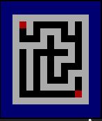

Chapter 7: Arrays
=======
At this point in this book, we have discussed data as scalar data types.  Each data item we have discussed is an abstraction of a single word in memory.  Whether we need an integer, a floating point number or character, these data items take up one memory word.

There are many applications that require data to be structured.  Data items are grouped with other similar data items to form a *collection* or *aggregate* of items.  C supports two such collections: arrays and structs.  We will handle arrays in this chapter and structs in Chapter 9.   

### Array Basics ###

Arrays are collections of data where each data item is identical and arranged in a sequence so that they can be referenced with integers.  Arrays in C start at  0 and, once declared, are fixed in length.  

Arrays in C are declared like this:

<pre>
<i>data_type</i> <i>array_name</i>[<i>length</i>]
</pre>

For example, consider this declaration:

    int arr[10];

This declares an array of 10 integers, stored adjacent to each other in memory.  

Once declared, individual data items can be referenced by their position in the collection.  References are formed from the array name with the position number in square brackets. The first element in the array collection always starts at position 0. For example, we can reference items from the above array as

    arr[3] = 12;

Here, the fourth element of the collection is assigned the value `12`.  

Array references are just like variable references, except the memory word used is *calculated* from the index given in the reference. These references work well:

    miles = arr[1] * arr[3];
    x = 6;
    arr[x] = 15;
    arr[x + 2] = arr[x-3] -4;

These references may look somewhat random or arbitrary, but the real genius of arrays comes in the ability to calculate an array reference, especially when we use array references in a for loop with a loop index.  For example, consider this code to compute a summation:

    for (int i=0; i<10; i++) sum += arr[i];

You can't do that with regular scalar variable names. 

The biggest danger with arrays is that an array reference might select an item from the array that's beyond the boundaries of the array.  This type of error is called an *out of bounds* reference.  For example, given the declaration above, the boundaries of the array are from index 0 to index 9.  Referencing index 10 would be an error, because it would be outside those boundaries.   

> **Complications With Out of Bounds References**
> 
You might expect that when an error occurs when running a program, the runtime system would likely stop with an error message.  However, even though it's an error to reference arrays outside their boundaries, C will always allow this *without* an error message.  
> 
Technically, the standard for the C language specifies out of bounds references as "undefined behavior," which means compilers can handle these any way they want.  The reality is that an out of bounds reference will access memory outside of the memory allocated for the array.  It will either access other variables in the program or it will access memory from protected areas, like memory dedicated to other running programs.  In the former case, such a reference constitutes a bug, changing memory in unintended ways.  In the latter case, the program will likely crash. 
>
For a further explanation on YouTube, [follow this link.](https://www.youtube.com/watch?v=ucQI5HpiFrI&t=42m47s)

Let's look at an array example that's a little more complex.  

    float numbers[20];
    int temp;
    int i,j;

    for (i=0; i<20; i++) numbers[i] = rand();

     for (i=0; i<19; i++)	
        for (j=0; j<19; j++) {
            if (numbers[j] > numbers[j+1]) {
                temp = numbers[j];
                numbers[j] = numbers[j+1];
                numbers[j+1] = temp;
            }
        }
    }

Here, we have an array of 20 integer numbers, initialized with a for loop to have random numbers as their values.  Then we use a Bubble Sort algorithm to sort the items in the array in ascending order.  A Bubble Sort is really an inefficient algorithm, but it is a very nice example of array manipulation.  We repeatedly go through the array, swapping adjacent array elements that are out of order. 

As an algorithm, the Bubble Sort is not very good in terms of performance.  However, the example above is an especially bad version of the Bubble Sort.  Exercise 7.1 will ask you to make it perform better.

> **More Information on the Bubble Sort**
> 
For more information on the Bubble Sort, also known as an exchange or sinking sort, check out [the Wikipedia page on it](https://en.wikipedia.org/wiki/Bubble_sort).

Notice all the array references in the Bubble Sort example.  The first line declares 20 elements in an array called `numbers`.  Each reference in the code is just like a variable reference.  Note that the for loop is careful to stop *before* `i` reaches 19; any further and there would be an out of bounds reference if, say, `i[19]` were to be compared to `i[20]`.  Since array references start at 0, reference item 20 would be out of bounds.  

### Multidimensional Arrays ###

We have seen that arrays are collections of identical items, arranged adjacent to each other in memory, referenced by position.  We can put anything into an array.  We can even have arrays of arrays; these are called two-dimensional arrays.

Two-dimensional arrays have two indicies: one to select the internal, one-dimensional array, and one to select the element from that array.  Here's an example of declaring a two-dimensional array:

    int arr[10][20];

Here, we have 10 arrays, each of which holds 20 integers.  In general, declarations and references look like:

<pre>
<it>array_name</it>[<it>array_number</it>][<it>item_number</it>];
</pre>

Now if we were to use this to select items from the above example, we could write something like this:

    x = arr[2][4] + arr[3][7];

Here, the fifth item (remember, arrays start at index 0) in the third array is added to the eighth item in the fourth array.  

It's not likely, however, that you will use arrays so arbitrarily.  It is more likely that you will use two-dimensional arrays as part of a larger structure, probably accessed by indicies in loops.  Consider the code below, for example:

    for (int i=0; i<10; i++) sum[i] = 0;
    for (int i=0; i<10; i++) {
        for (int j=0; j<20; j++) {
            sum[i] += arr[i][j];
        }
    }

Here, the two loops provide a way to make a summation of the arrays declared above.  Presumably, `sum` is an integer array with at least 10 items.

Two-dimensional arrays are often used as tables, structured as rows and columns.  This means that a table can be declared as an array with rows of columns:

    int rows = 10;
    int columns = 20;
    int table[rows][columns]; 

This means that to find the fifth column in the second row, you would access `table[1][4]`, remembering that each index starts at 0.  

> **Rows of Columns or Columns of Rows**
> 
Are tables built as row of columns or columns of rows?  With an array built as a table, should you select the column first, then the row, or the other way around? 
>
There has been some good discussion on this.  Some people refer to the source code of the compiler.  Some people pull examples from higher mathematics.  Most people have a personal preference.
>
The real truth is that it does not matter.  If you reference a two-dimensional array in a consistent manner, it will work in either configuration.

If two-dimensional arrays are possible, one would think that more dimensions are possible.  Three-dimensional arrays work like a collection of tables, each of which has rows and columns.  A declaration like this:

    int threeD[10][20][30];

declares 10 tables, each having 20 rows and 30 columns.  And we could go to four and five dimensions if we wanted to.  However, as the dimensions go higher, the usefulness of the array decreases dramatically.   

A final note should be made on the memory requirements of multidimensional arrays.  To estimate the amount of memory used by an array, multiply the indicies together.  A 10 by 20 integer array holding 10 rows of 20 columns is using 200 integers.  A table that size might be usable, but beware of creating tables of large arbitrary size just because you "might" need the space.  A 200 by 200 floating point table contains 40,000 floats, which will likely overflow the memory allocated to a program on a Pebble watch.  Only use arrays as sparingly and tightly controlled as possible and keep the amount of memory used to a minimum. 

### Common Array Operations ###

Arrays are very useful data structures.  There are several operations that are commonly done on arrays that make them so useful.  Let's review some of these.

We have seen where it is useful to initialize variables before we use them.  We have mentioned how it would be a mistake to assume that variable values are automatically initialized to 0.  The same is true for arrays.

Arrays are commonly initialized with for loops.  Since we know the starting index of arrays and the size of an array (from the declaration), for loops are a great choice for iterating over all array elements to initialize them. For example, we could initialize our two-dimensional table from the above example this way:

    for (int i=0; i<rows; i++) 
        for (int j=0; j<columns; j++) 
            table[i][j] = 0;

Initialization is used so often, C has some special syntax to initialize arrays without for loops.  Like with other types of variables, C allows arrays to be initialized in their declaration.  The initialization part takes the form of values enclosed by curly braces. Consider this example:

    int arr[10] = {0, 1, 2, 3, 4, 5, 6, 7, 8, 9};

Each element of the `arr` array gets an initial value with this statement.  

Now, initialization to zero happens so often that you can use abbreviated initialization syntax to do this. You may leave out values and they will be assumed to be zero.  This works only when the *remaining* values after specific initialization.  Here's an example:

    int arr[10] = {0, 1, 2};

Here, all the elements of the `arr` array are initialized. Only elements 1 and 2 have non-zero values; all others are set to zero.  

This syntax can also be applied to multidimensional arrays.  Remember that multidimensional arrays can be thought of as "nested" arrays and this syntax makes more sense.  Consider this example:

    int table[5][3] = { { 1, 2, 3},
                        {10, 20, 30}, 
                        {100, 200, 300},
                        {1000, 2000, 3000},
                        {10000, 20000, 30000} };

Inserting elements into an array is a common operation.  When inserting something into an array, the items from the insertion point to the end of the array get moved down.  If the array is full of valid elements, the last one at the end gets lost.  Code to do this might look like

    insertion_point = 3;
    for (int i=insertion_point; i<array_length-1; i++)
        arr[i+1] = arr[i];
    arr[insertion_point] = new_element;
    array_length ++;

This assumes that `array_length` is maintained by other code and is at least equal to 4.

Like insertion, deletion is also a common operation.  In a deletion, the elements from the next element to the deletion point to the end of the array get shifted left.  The deleted element is lost.  Consider this example:

    deletion_point = 3;
    for (int i=deletion_point; i<array_length-1; i++)
        arr[i] = arr[i+1];
    array_length --;

The last element at the `array_length+1` point is now considered to have an invalid value.

For both insertion and deletion, care must be taken not to use values outside the bounds of the array.  

### Things You Cannot Do With Arrays ###

Arrays are very versatile structures, but there are some things you cannot do with an array that might, at first glance, seem intuitively possible.

You cannot get the actual length of the valid elements in an array.   Once you declare an array to be of a certain length, you cannot determine it's "real" length; all elements of an array can be used at any time.  Uninitialized elements of an array are just like uninitialized variables: you cannot assume that any element of an array has an initial value unless you expressly initialize the array.   

Once an array's length is set in a declaration, you cannot extend that length.  As we have stated before, any attempt to use array elements beyond the declared end of the array will likely (although not *always*) result in an out of bound runtime error.

You cannot perform operations that might seem logical to perform on an entire array.  Operations like filling an array with values (after initialization), reversing the contents, copying the contents, sorting the array, or searching for a value all require code that uses loops to access each array element individually.  These operations cannot be performed on the entire array in one operation.

> **Deriving Array Length**
>
Deriving an array's length can be a useful operation.  It can help a program make decisions about arrays and can help a program to keep references inside the array's boundaries.  It is true that you cannot derive the number of array elements that hold initialized values.  However, you *can* derive the total allocated length of an array by computing `sizeof(array) / sizeof(data_type)`: the total allocated memory space divided by the size of the data type of each array element.

### Arrays as Function Parameters ###

Arrays can be passed as parameters to functions.  There are three ways to declare an array as a formal parameter in a function.

The first way is *as a sized array*.  You include all parts of a "regular" array declaration in the function header, like so:

    int func(int param[10]) {...}

This is the most restricted way to declare a parameter.  The actual parameter must be an integer array and must only have 10 elements declared for it.  

The second way to declare an array as a function parameter is *as an unsized array*.  This is just like the last method, except the number of array element is left out.  Here's an example:

    int func(int param[]) {...}

This method will allow any array declared to have any number of integer elements.  

Let's consider a bigger example.  Let's assume we have a main function that looks like this:

    void main() {
        int numbers[6] = {10, 20, 1, 5, 19, 50};
        float average;

        average = computeAverage(numbers, 6);

        printf("Average of these values is %f\n", average);
    }

This code assumes that a function called `computeAverage` exists and takes an array with an array size as parameters. Note we have to send the size along with array because, as we stated previously, we cannot derive the size of an array from the array itself. We can define the function using either method above.  Here it is with a sized array as a parameter:

    float computeAverage(int nums[6], int asize) {
        float sum = 0.0;
        for (int i=0; i<asize; i++) {
            sum += nums[i];
        }
        return sum / asize;
    }

We can also replace the header with this header:

    float computeAverage(int nums[], int asize) 

and the result is the same.  This version is more flexible and will work with any integer one-dimensional array.

> **What About Arrays with Out Of Bounds Sizes?**
> 
If you declare an array in the parameters of a function, and that array is declared to have a size, then the compiler can check if the arrays used as actual parameters fit that size.  Out of bounds actual parameters are errors, right?
>
You might think so, but earlier in this chapter, we discussed out of bounds references.  They are not caught by the compiler and might work in the runtime system.  It is actually up to the compiler writers whether this type of error is flagged and, in many compilers, it is not.

There is one more way to declare an array as a function parameter.  As a preview for the next chapter, we could declare the array as a *pointer* to an integer in memory.  This would look like:

    int func(int *param) {...}

As we will deal with this in the next chapter, we won't say any more about this method here.

### Project Exercises ###

#### Project 7.1 ####

Consider the Bubble Sort example from the beginning of this chapter. [Get the example code into CloudPebble by clicking this link.](https://cloudpebble.net/ide/import/github/programming-pebble-in-c/project-7-1) 

There are at least three ways to make the algorithm perform better.

* One way still uses two for loops, but assumes the first part of the array is sorted and adjusts the index of the second loop accordingly.
* A second way uses a while loop as the outside loop, looping until a boolean variable (`sorted`) becomes true.
* A third way combines these two.

Rewrite the example code to demonstrate each of these methods. Add new functions and call those function instead of `bubble_sort`.

Be sure to comment your code and leave your name on it.

[A demonstration of these methods can be found here.](https://cloudpebble.net/ide/import/github/programming-pebble-in-c/project-7-1-answer)

#### Project 7.2 ####  

This exercise revisits Project 6.2.  That project, [whose answer can be found here](https://cloudpebble.net/ide/import/github/programming-pebble-in-c/project-6-2-answer), takes a sequence of characters in a string and considers them in groups of three, drawing 5 rows of three squares.  

Starting with the result of Project 6.2, change the code to draw four numbers instead of one.  

1. Change the single digit `char *digit = '111101111101111'` string from Project 6.2 to a 10 element array called `digit_array` that describes in 1's and 0's how to draw all the digits from 0 to 9. Because a string is just an array of characters, you can refer to each character from the string with an array reference.  Therefore, changing the one string into an array of strings will actually change the structure to a two-dimensional array of characters.
2. In `canvas_update_proc`, add code to draw four random digits.  Generate a random number between 0 and 9 (inclusive) by this statement:

    choice = rand()%10;

To use the random number generator, you will have to add the statement `srand(time(NULL));` to the `init` function. Call the  `draw_digit` function four times to draw rand numbers at top left, top right, bottom left and bottom right corners of the screen.  Note that you can compute where the X coordinate of the top left using this:

    s_main_window_center.x-digit_width-(tile_size/2)

In a similar fashion, the Y coordinate can be computing as

    s_main_window_center.y-digit_height-(tile_size/2)

We will leave you to figure out where the other three digits are to be placed.

As an extra challenge, add code to regenerate the random numbers by making the `s_canvas_layer` dirty when the middle button is pressed.  (This is really not that big of a challenge; see Project Exercise 7.3 to figure this out.)

We will get to strings in all their glory in Chapter 9.

Comment your code and claim it.

[You can find an answer here.](https://cloudpebble.net/ide/import/github/programming-pebble-in-c/project-7-2-answer)

#### Project 7.3 ####

[Take look at the starter code for Project 7.3.](https://cloudpebble.net/ide/import/github/programming-pebble-in-c/project-7-3)  This code generates a maze in the two-dimensional array called `maze`.  This array is an array of boolean values.  If a value in the (x,y) position in the array is `true`, then there is a wall at that (x,y) coordinate.  If the value is false, then the space at the (x,y) coordinate is open.  Consider this maze:  

<figure>
   

   
   <figcaption>
      <b>Figure 7.1:</b> An example maze. 
   </figcaption>
   

</figure>

The first value at position at `(0,0)` is false; the value at the position to the right is true.  Mazes always begin at `(0,0)` and end in the bottom right corner at `(MAZE_WIDTH, MAZE_HEIGHT)`.  

Have a look at the `generate_maze` function.  Using a a random number generator, this function goes through the maze in a recursive manner, randomly setting paths.  Because clearing the maze sets all values to true (with a wall), this function wanders through the maze, setting a clear (false) path from beginning to end, with some dead ends in-between.

This project ask you to do three things.  These things are connected to the button on the watch.

1. **Draw the maze on the Pebble screen.**  The bottom button is connected to the code that (a) clears any solution that has been generated, (b) clears the maze on the screen, and (c) generates a new maze.    Then it flags the maze and solution layers as "dirty", that is, in need of update.  This means that the function `maze_layer_update` will be called.  Find this function and add code to replace the comment:

    // [Put your maze drawing code here]

That code should check each row and column, from `(0,0)` to `(MAZE_WIDTH, MAZE_HEIGHT)`, and draw a rectangle in each spot.  The code below should be useful:

      graphics_context_set_fill_color(ctx, maze[x][y] ? GColorWhite : GColorBlack);
      cell = GRect((x * CELL_SIZE), (y * CELL_SIZE), CELL_SIZE, CELL_SIZE);
      graphics_fill_rect(ctx, cell, 0, GCornerNone);

This code puts a white or black rectangle at the coordinate (x,y), depending on the boolean value in `maze[x][y]`.

2. **Solve the maze.**  The select (middle) button is connected to code that generates a solution to the currently generated maze and draws the solution.  Find the function `solve_maze`.  Generate a solution to the current maze by adding code to replace the comment

    // [Put your maze solving code here]

Pattern your solution after the `generate_maze` function, but now you will be changing the array called `solved_maze`.  In addition, a true value in an array variable means a solved position along the solution path and a false value means an open position.  

3. **Draw the solution on the Pebble screen.**  The solution is drawn in the code by calling the function named `solution_layer_update`. Fill in this code to draw the solution contained in the `solved_maze` array. Like with the `maze_layer_update` function, your code should go through the array's values, but now only draw a red rectangle if the corresponding square in your solution is `true`. Pattern your drawing using the code above and the color `GColorRed`.   

Comment the code, especially the functions that implement the solution.

[An answer can be found here.](https://cloudpebble.net/ide/import/github/programming-pebble-in-c/project-7-3-answer)

